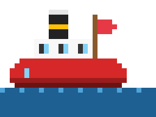
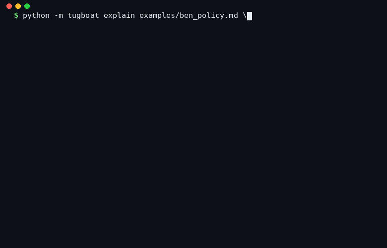

<p align="center">
  
</p>

<h1 align="center">Tugboat</h1>

<p align="center">
  <em>A tiny, declarative routing layer for agent harnesses.<br/>
  Four axes, one decision, markdown policy, stdlib only.</em>
</p>

<p align="center">
  <a href="https://github.com/atxgreene/tugboat/actions/workflows/tests.yml"></a>
  <a href="LICENSE"></a>
  <a href="pyproject.toml"></a>
  <a href="#"></a>
  <a href="#"></a>
</p>

<p align="center">
  
</p>

> "The harness is the product."

Tugboat is a tiny, pluggable **routing layer** for agent harnesses. It sits
between your turn and your model, reads a declarative policy, and makes one
decision across four axes:

| Axis          | What it picks                                     |
| ------------- | ------------------------------------------------- |
| **Memory**    | which memory slices to load, with a token budget  |
| **Subagent**  | whether to delegate, to which spec, how to merge  |
| **Skill**     | which tools are in scope (and which are blocked)  |
| **Model**     | which engine / model id to call                   |

That four-axis decision is a first-class object you can log, diff, replay,
and evaluate. The central thesis (distilled from the Meta-Harness paper, from
Peter Pang's "harness engineering" write-up, and from Anthropic's Claude Code
post-mortems) is that **at a fixed model, the routing layer is where most of
the performance delta lives** — so make it explicit, small, testable, and
owned by you.

Tugboat is the navigator. It's not the captain. It doesn't decide *what* you
want, only *how* to get the turn from A to B.

---

## Install

No install. It's stdlib-only Python 3.10+.

```bash
cd tugboat
python -m unittest discover tests        # 34 tests, < 30ms
python examples/basic_usage.py           # full end-to-end demo
```

## 60-second tour

```python
from tugboat import Tugboat, Turn
from tugboat.channels import (
    InMemoryMemoryChannel, DictSkillChannel, MultiEngineModelChannel,
)
from tugboat.engines import MockEngine
from tugboat.policy import load_policy

policy  = load_policy("examples/ben_policy.md")
memory  = InMemoryMemoryChannel(
    slices={"identity": "BEN", "recent_daily": "today"},
    identity="I am BEN, the Navigator.",
)
skills  = DictSkillChannel({"formatter": lambda t: ("formatter", t.text)})
models  = MultiEngineModelChannel({
    "ollama": MockEngine(),
    "cloud":  MockEngine(),
})

tug = Tugboat(policy=policy, memory=memory, skills=skills, models=models)

print(tug.explain(Turn(text="draft a tweet", task_class="drafting")))
# model:  ollama :: qwen2.5:14b-instruct
# reason: drafting, local first per Phase 4 routing policy
# ...
```

Two modes:

- **Plugin mode** — `tug.route(turn)` returns a `RoutingDecision` without
  executing it. Hand that back to your existing harness.
- **Driver mode** — `tug.execute(turn)` assembles the prompt, runs the model
  (or spawns the subagent), merges the memory, and returns a `TurnResult`.

Plus two UX primitives on top:

- `tug.explain(turn)` — pretty-print what the router *would* do without
  running anything. Good for code review and incident postmortems.
- `tug.regret(turn, proposed_policy)` — diff the current policy's decision
  against a proposed policy's decision. The "PR diff for routing" UX for
  reviewing policy edits before you commit them.

## The policy file IS the router

Policies are plain markdown. No YAML, no DSL, no code. This matches the style
Austin already writes in `AGENTS.md` / `SOUL.md`.

```markdown
# Defaults
- model.engine: ollama
- model.model: qwen2.5:14b-instruct
- memory.budget_tokens: 2000
- memory.slices: [identity, recent_daily]
- skill.active: [formatter, memory_writer]

## Rule: local for drafting and summaries
when: task_class == drafting
then:
  - model.engine = ollama
  - model.model = qwen2.5:14b-instruct

## Rule: cloud fallback for long context
when: context_tokens > 8000
then:
  - model.engine = cloud
  - model.model = claude-opus-4-6
  - memory.budget_tokens = 6000

## Rule: delegate research to the researcher subagent
when: task_class == research
then:
  - subagent.delegate = true
  - subagent.spec_name = researcher
  - subagent.merge_strategy = merge_memory

## Rule: confirm before external actions
when: external_action
then:
  - confirm_before_execute = true

## Subagent: researcher
- goal: investigate a topic across available sources
- scoped_tools: [web_search, read_file, memory_writer]
- model_engine: cloud
- model_id: claude-opus-4-6
- memory_scope: read_parent
- merge_strategy: merge_memory
- max_iterations: 8
```

Rules fire in file order. Later rules win on overlap. Two hard invariants
the policy cannot override: `external_action` always forces confirmation,
and identity memory is always loaded (the Mnemosyne lock).

## Subagents

A subagent is a scoped child turn with its own memory policy and merge
strategy. The parent decides, the subagent runs, and the parent decides
how much of the subagent's side-effects to accept:

| Strategy         | What happens to subagent memory writes                      |
| ---------------- | ----------------------------------------------------------- |
| `return_only`    | discarded (used for triage or preview runs)                 |
| `append_log`     | captured as a log entry, NOT merged into memory             |
| `merge_memory`   | applied to the parent's memory channel                      |

Subagents emit memory writes via inline tags in their output:

```
Answer text here.
<memory slice="long_term">fact the subagent learned</memory>
<memory slice="notes" kind="replace">fresh replacement</memory>
```

## Personalization: per-user and per-context rules

`Turn` carries `user` and `context` fields. The policy grammar matches them
like any other field, so personalization is just more markdown:

```markdown
## Rule: aus always confirms outbound tweets
when: user == aus and external_action
then:
  - confirm_before_execute = true

## Rule: morning brief loads long-term memory
when: context == morning_brief
then:
  - memory.slices += [long_term]
  - memory.budget_tokens = 4000
```

No ML, no hidden state, no "preferences database" to keep in sync. Your
user's decisions matrix is whatever rules you have written.

## The OODA loop: observer → orient → propose

The core router is pure and deterministic. Learning lives in a separate,
opt-in outer loop that watches turns, mines patterns, and emits *proposed*
policy edits as markdown diffs. The human reviews and commits.

```python
from tugboat import TurnLogger, orient

logger = TurnLogger("./tugboat.jsonl")
for turn in turns:
    result = tug.execute(turn)
    logger.log(turn, result)

# later, offline:
proposals = orient(logger.read_all(), min_support=3)
for p in proposals:
    print(p.to_markdown())        # ready to paste into your policy file
```

The observer never mutates the policy directly. It *suggests*. You commit.
That's what keeps the router deterministic and the eval story honest.

See [`docs/architecture.md`](docs/architecture.md) for the full three-layer
stack (Knowledge → Routing → Harness) and how the OODA loop sits above it.

## CLI

```bash
python -m tugboat explain examples/ben_policy.md "research the harness thesis" --task-class research
python -m tugboat route   examples/ben_policy.md "tweet this" --external
python -m tugboat execute examples/ben_policy.md "draft something" --task-class drafting
```

## Layout

```
tugboat/
  tugboat/
    adapter.py     # Top-level Tugboat class (plugin + driver + regret)
    navigator.py   # Pure route(): Turn + Policy -> RoutingDecision
    policy.py      # Markdown -> Policy (defaults, rules, subagents)
    channels.py    # Memory / Skill / Model channel protocols + refs
    subagent.py    # Subagent spawn, memory-write extraction, merge
    observer.py    # JSONL log + offline pattern mining + RuleProposal
    engines/
      base.py         # Engine protocol + EngineResponse
      mock_engine.py  # deterministic engine for tests
      ollama_engine.py# local Ollama via stdlib urllib
  examples/
    ben_policy.md   # BEN-flavored policy distilled from openclaws
    basic_usage.py  # full end-to-end demo
  docs/
    architecture.md # the three-layer stack (Knowledge / Routing / Harness)
  tests/
    test_policy.py test_navigator.py test_subagent.py
    test_adapter.py test_observer.py
```

## Plumbing a real engine in

The OllamaEngine ships and works with a local `ollama serve`:

```python
from tugboat.engines import OllamaEngine
from tugboat.channels import MultiEngineModelChannel

models = MultiEngineModelChannel({
    "ollama": OllamaEngine(base_url="http://localhost:11434"),
    # "cloud": YourClaudeEngine(...),   # implement the Engine protocol
})
```

The `Engine` protocol is two methods: `generate(prompt, decision) -> EngineResponse`
and a `name` property. Bring your own.

## Why Tugboat and not an existing framework

1. **Tiny.** ~1,200 lines of stdlib Python, zero dependencies. You can read
   the whole thing in an hour.
2. **Deterministic.** `route()` is pure: same `(turn, policy)` → same
   decision. That's what makes evals actually measure something.
3. **Plugin-shaped.** You can drop it into any harness as a decision function
   and ignore `execute()` entirely.
4. **Policy as data.** The router is a markdown file, not a code path. Diff
   it. Version it. Hand it to a non-engineer.
5. **Subagent-first.** The one thing almost every harness post-mortem cites
   as the lever is subagent orchestration. Tugboat makes it the point.

## Status

MVP. 34 unit tests green. Single-turn execution, no ReAct loop yet. Policy
supports `and`; no `or` yet (add when needed). Built for the openclaws fleet
and the BEN navigator persona.
